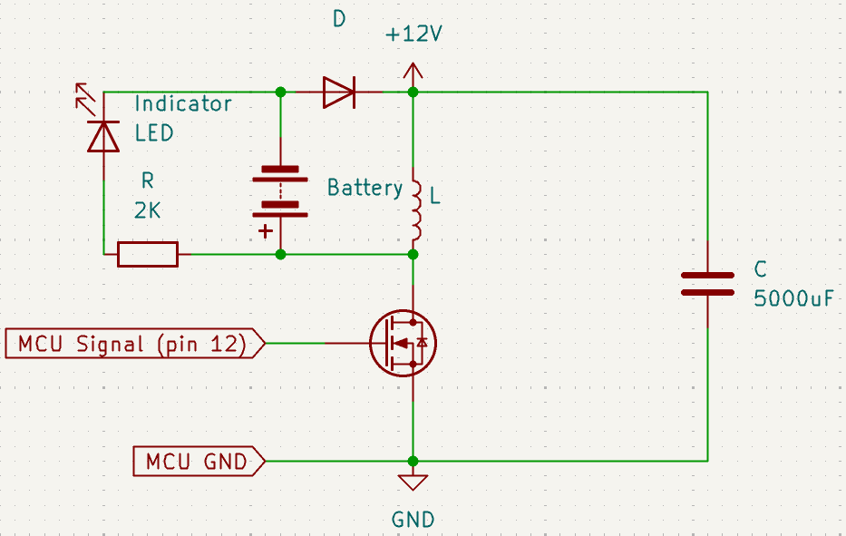

desulfator
==========

Pulse charger for dead lead-acid batteries. Can help to (maybe) recover a not that very dead battery, and throw a really dead one away without your toad strangling you about 'maybe there was a way to recover it'.

MCU: Atmega328p.
Also needed: 
* BIG coil (I used 0.6mH) that can tolerate high currents
* Nchannel power mosfet
* High current diod
* 12V power supply, i.e. ATX PSU

## Scheme

## Algo

Like DC-DC up. Charge coil short-circuiting it to PSU, discharge into the battery.

Frequencies: 7813 kHz short pulses + 122 Hz power pulses.

## Build & flash Instructions
1. Install prerequisites as described in the [`avr-hal` README] (`avr-gcc`, `avr-libc`, `avrdude`, [`ravedude`]).

2. Run `cargo build --release` to build the firmware.

3. Edit the `Ravedude.toml` file to configure your board and serial port.

4. Run `cargo run --release` to flash the firmware.

# Final design

